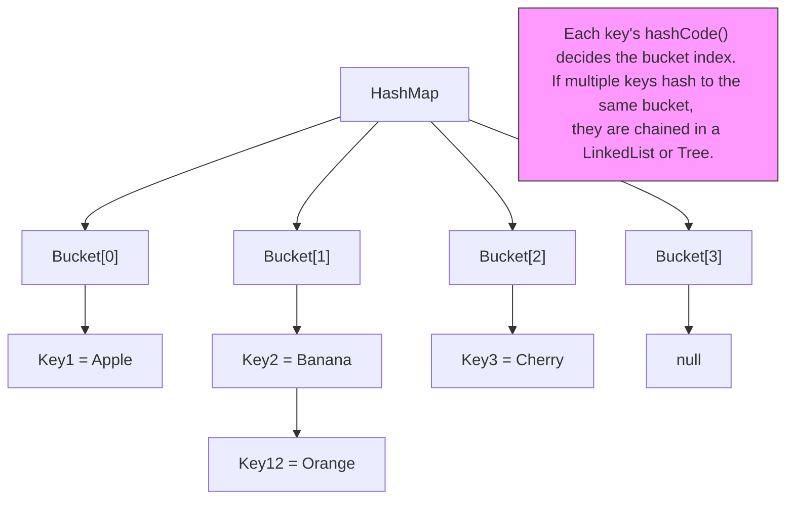

```mermaid
graph TD
    HashMap[HashMap]

    HashMap --> Bucket0["Bucket[0]"]
    HashMap --> Bucket1["Bucket[1]"]
    HashMap --> Bucket2["Bucket[2]"]
    HashMap --> Bucket3["Bucket[3]"]

    Bucket0 --> Key1["Key1 = Apple"]

    Bucket1 --> Key2["Key2 = Banana"]
    Key2 --> Key12["Key12 = Orange"]
    %% Collision handled via LinkedList/Tree

    Bucket2 --> Key3["Key3 = Cherry"]

    Bucket3 --> Null["null"]

    Note["Each key's hashCode() decides the bucket index. 
If multiple keys hash to the same bucket, 
they are chained in a LinkedList or Tree."]:::note

    classDef note fill:#f9f,stroke:#333,stroke-width:1px;
```