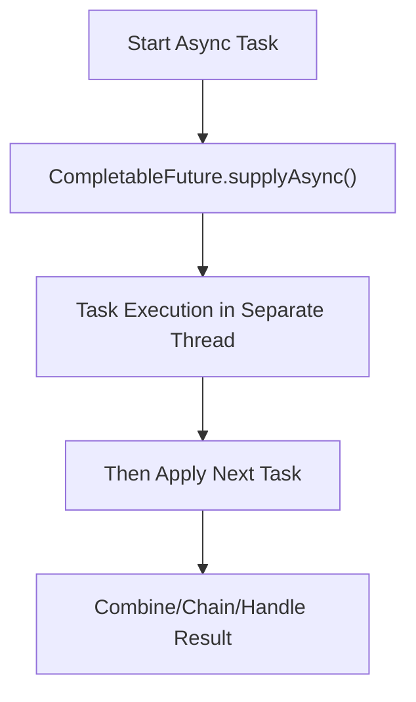

```mermaid
flowchart TD
    A["Start Async Task"] --> B["CompletableFuture.supplyAsync()"]
    B --> C["Task Execution in Separate Thread"]
    C --> D["Then Apply Next Task"]
    D --> E["Combine/Chain/Handle Result"]
```