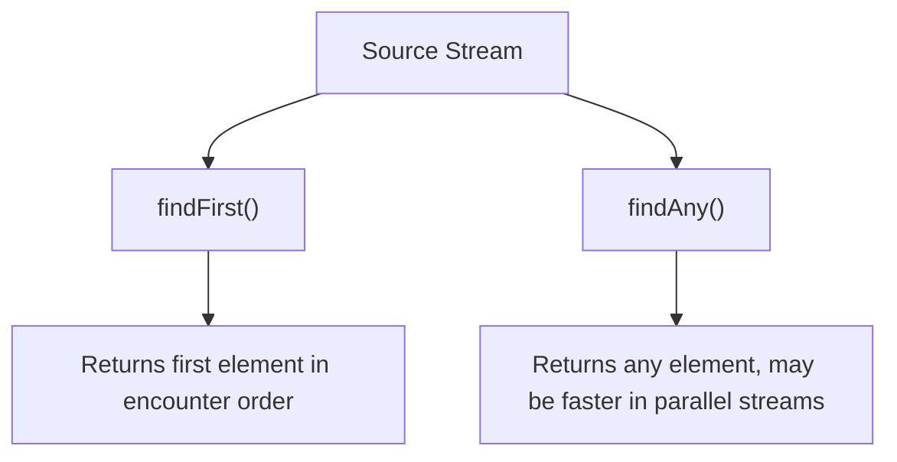

```mermaid
flowchart TD
    A["Source Stream"] --> B["findFirst()"]
    A --> C["findAny()"]
    B --> D["Returns first element in encounter order"]
    C --> E["Returns any element, may be faster in parallel streams"]
```