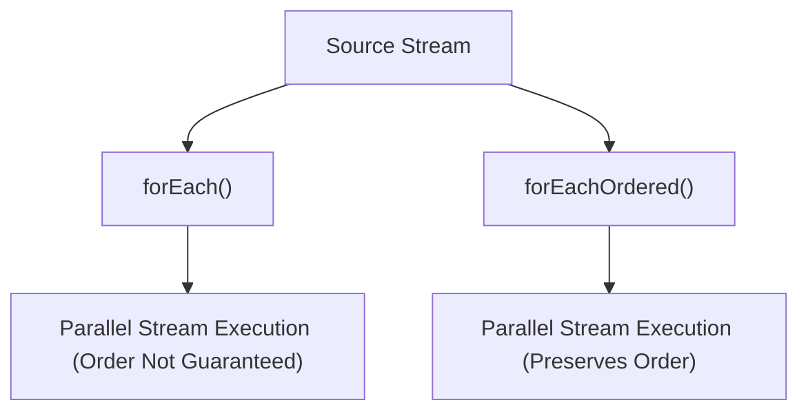

```mermaid
flowchart TD
    A["Source Stream"] --> B["forEach()"]
    A --> C["forEachOrdered()"]
    B --> D["Parallel Stream Execution (Order Not Guaranteed)"]
    C --> E["Parallel Stream Execution (Preserves Order)"]
```