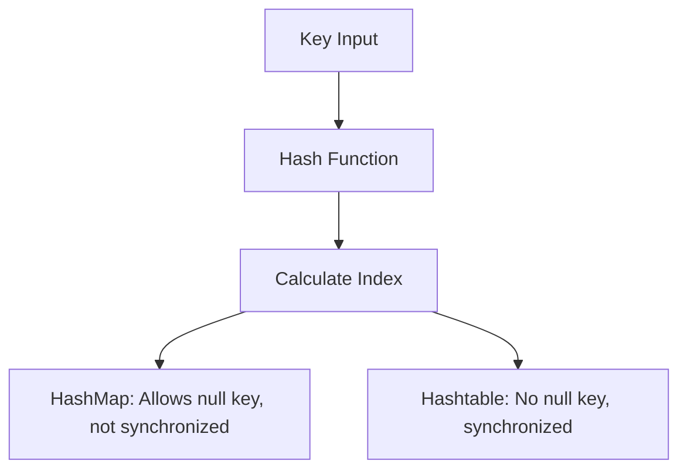

```mermaid
flowchart TD
    A["Key Input"] --> B["Hash Function"]
    B --> C["Calculate Index"]
    C --> D["HashMap: Allows null key, not synchronized"]
    C --> E["Hashtable: No null key, synchronized"]
```