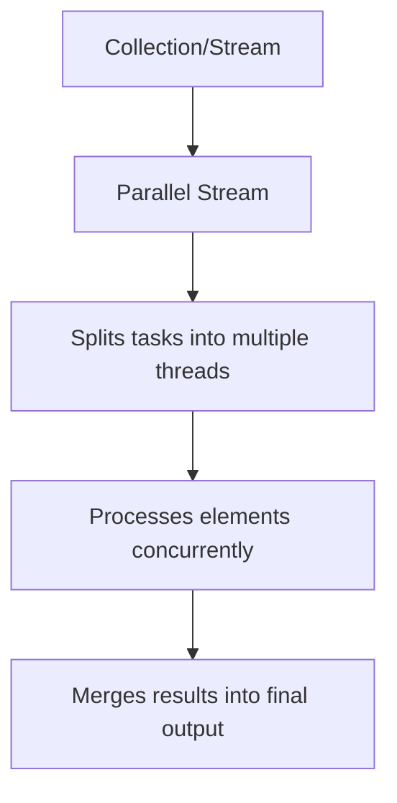

```mermaid
flowchart TD
    A["Collection/Stream"] --> B["Parallel Stream"]
    B --> C["Splits tasks into multiple threads"]
    C --> D["Processes elements concurrently"]
    D --> E["Merges results into final output"]
```