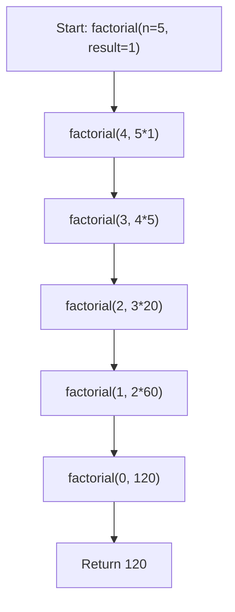

```mermaid
flowchart TD
    Start["Start: factorial(n=5, result=1)"] --> Call1["factorial(4, 5*1)"]
    Call1 --> Call2["factorial(3, 4*5)"]
    Call2 --> Call3["factorial(2, 3*20)"]
    Call3 --> Call4["factorial(1, 2*60)"]
    Call4 --> Call5["factorial(0, 120)"]
    Call5 --> End["Return 120"]
```