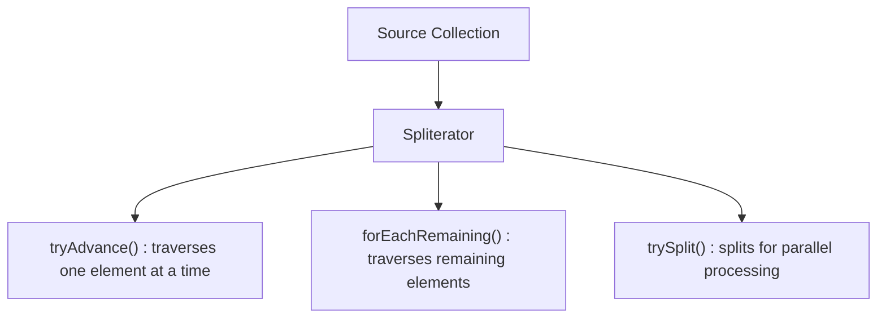

```mermaid
flowchart TD
    A["Source Collection"] --> B["Spliterator"]
    B --> C["tryAdvance() : traverses one element at a time"]
    B --> D["forEachRemaining() : traverses remaining elements"]
    B --> E["trySplit() : splits for parallel processing"]
```