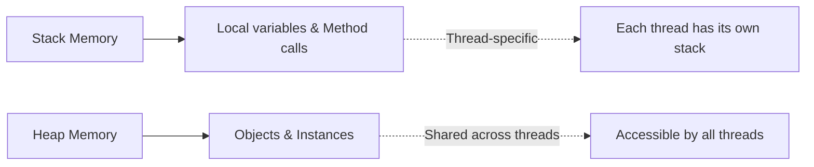

```mermaid
flowchart LR
    A["Stack Memory"] --> B["Local variables & Method calls"]
    C["Heap Memory"] --> D["Objects & Instances"]
    B -. "Thread-specific" .-> E["Each thread has its own stack"]
    D -. "Shared across threads" .-> F["Accessible by all threads"]
```