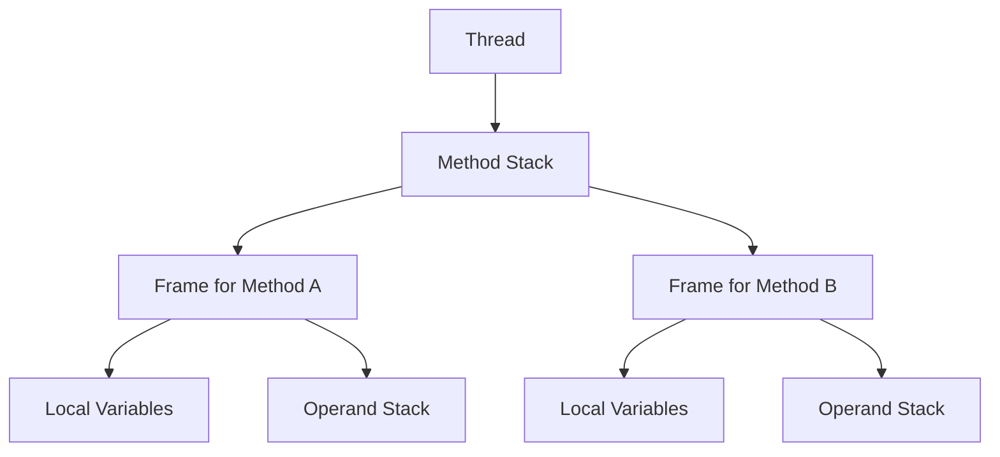

```mermaid
flowchart TD
    Thread --> Stack[Method Stack]
    Stack --> Frame1[Frame for Method A]
    Stack --> Frame2[Frame for Method B]
    Frame1 --> LocalVarsA[Local Variables]
    Frame1 --> OperandStackA[Operand Stack]
    Frame2 --> LocalVarsB[Local Variables]
    Frame2 --> OperandStackB[Operand Stack]
```