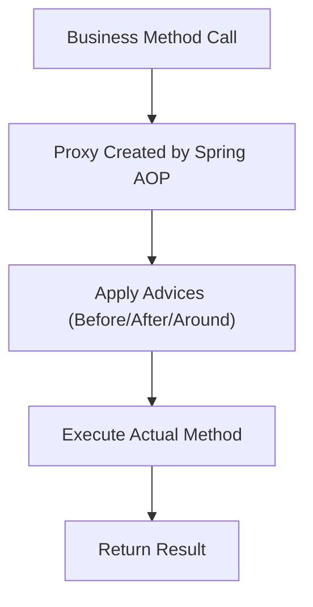

```mermaid
flowchart TD
    A["Business Method Call"] --> B["Proxy Created by Spring AOP"]
    B --> C["Apply Advices (Before/After/Around)"]
    C --> D["Execute Actual Method"]
    D --> E["Return Result"]
```