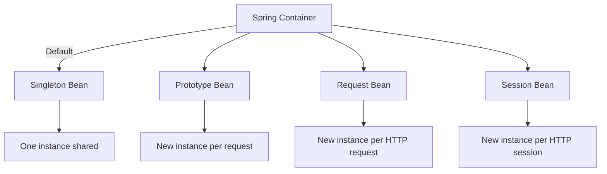

```mermaid
flowchart TD
    A["Spring Container"] -->|Default| B["Singleton Bean"]
    A --> C["Prototype Bean"]
    A --> D["Request Bean"]
    A --> E["Session Bean"]

    B --> F["One instance shared"]
    C --> G["New instance per request"]
    D --> H["New instance per HTTP request"]
    E --> I["New instance per HTTP session"]
```