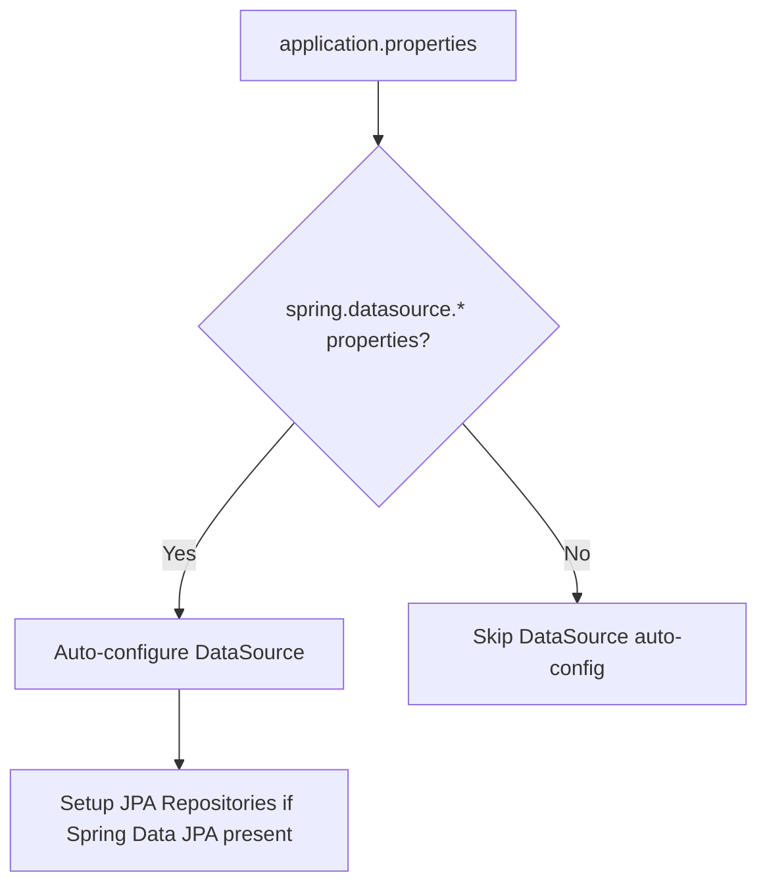

```mermaid
flowchart TD
    A["application.properties"] --> B{"spring.datasource.* properties?"}
    B -->|Yes| C["Auto-configure DataSource"]
    B -->|No| D["Skip DataSource auto-config"]
    C --> E["Setup JPA Repositories if Spring Data JPA present"]
```