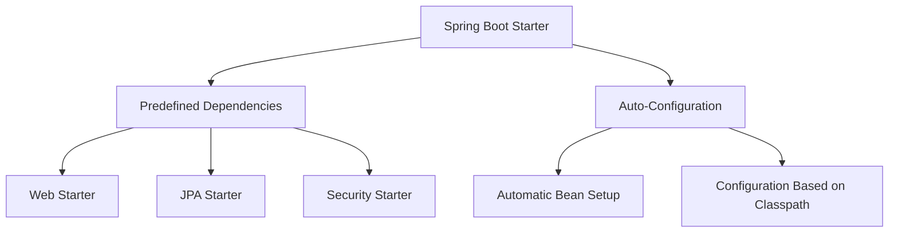

```mermaid
flowchart TD
    A["Spring Boot Starter"] --> B["Predefined Dependencies"]
    B --> C["Web Starter"]
    B --> D["JPA Starter"]
    B --> E["Security Starter"]
    A --> F["Auto-Configuration"]
    F --> G["Automatic Bean Setup"]
    F --> H["Configuration Based on Classpath"]
```