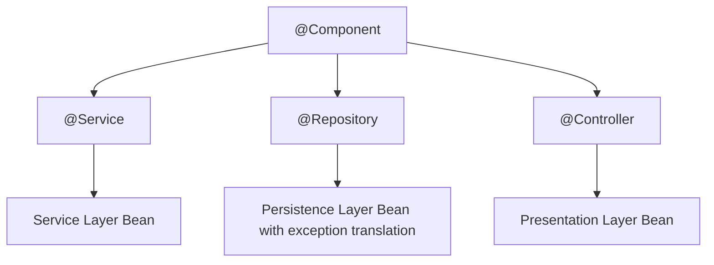

```mermaid
flowchart TD
    A["@Component"] --> B["@Service"]
    A --> C["@Repository"]
    A --> D["@Controller"]
    B --> E["Service Layer Bean"]
    C --> F["Persistence Layer Bean with exception translation"]
    D --> G["Presentation Layer Bean"]
```