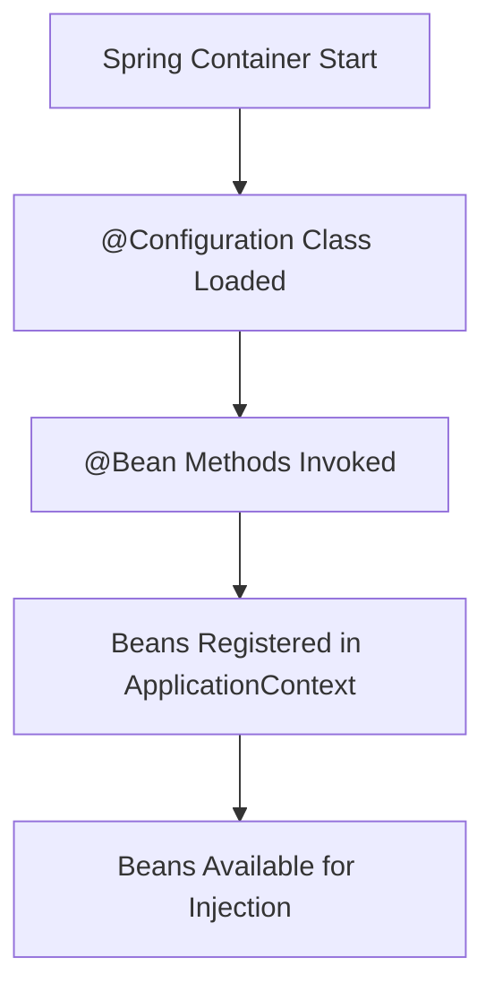

```mermaid
flowchart TD
    A["Spring Container Start"] --> B["@Configuration Class Loaded"]
    B --> C["@Bean Methods Invoked"]
    C --> D["Beans Registered in ApplicationContext"]
    D --> E["Beans Available for Injection"]
```