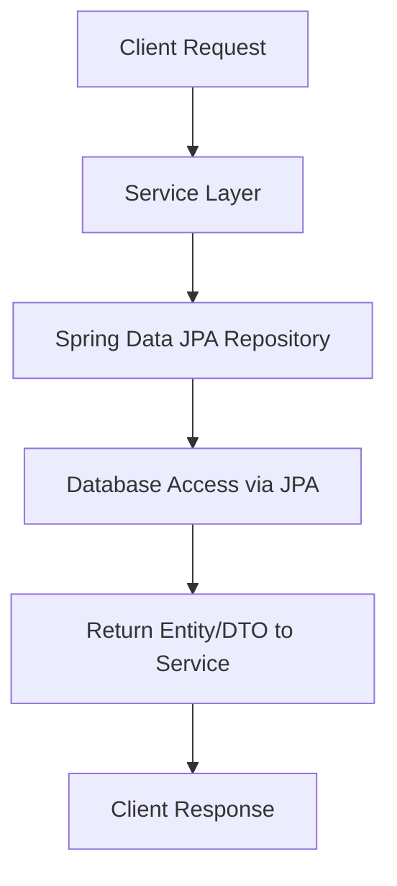

```mermaid
flowchart TD
    A["Client Request"] --> B["Service Layer"]
    B --> C["Spring Data JPA Repository"]
    C --> D["Database Access via JPA"]
    D --> E["Return Entity/DTO to Service"]
    E --> F["Client Response"]
```