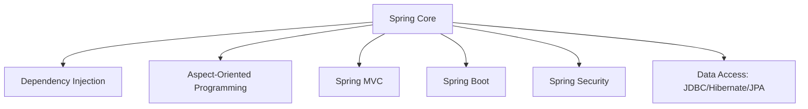

```mermaid
flowchart TD
    A["Spring Core"] --> B["Dependency Injection"]
    A --> C["Aspect-Oriented Programming"]
    A --> D["Spring MVC"]
    A --> E["Spring Boot"]
    A --> F["Spring Security"]
    A --> G["Data Access: JDBC/Hibernate/JPA"]
```    