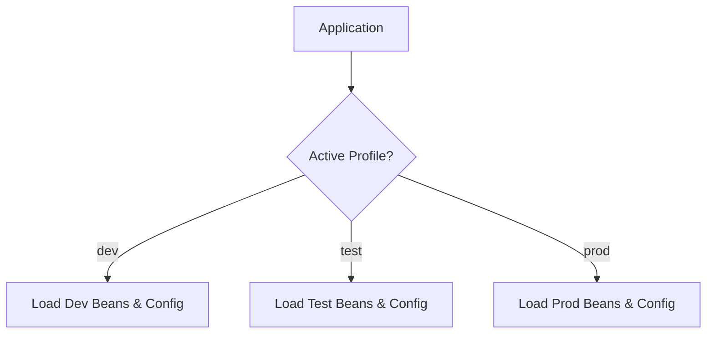

```mermaid
flowchart TD
    A["Application"] --> B{"Active Profile?"}
    B -->|dev| C["Load Dev Beans & Config"]
    B -->|test| D["Load Test Beans & Config"]
    B -->|prod| E["Load Prod Beans & Config"]
```