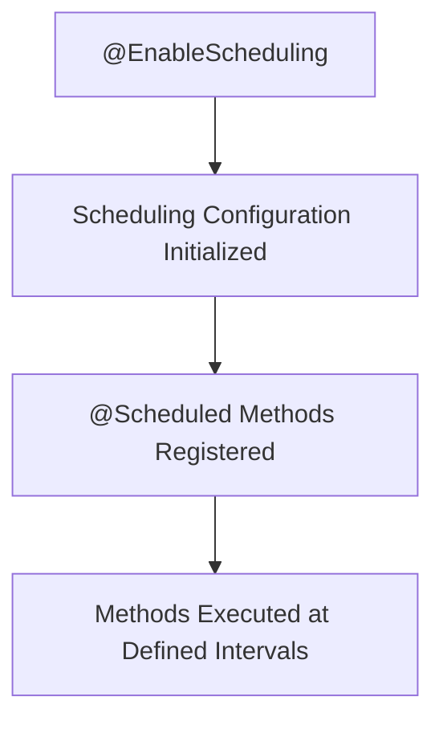

```mermaid
flowchart TD
    A["@EnableScheduling"] --> B["Scheduling Configuration Initialized"]
    B --> C["@Scheduled Methods Registered"]
    C --> D["Methods Executed at Defined Intervals"]
```