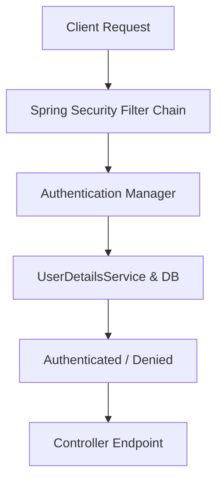

```mermaid
flowchart TD
    A["Client Request"] --> B["Spring Security Filter Chain"]
    B --> C["Authentication Manager"]
    C --> D["UserDetailsService & DB"]
    D --> E["Authenticated / Denied"]
    E --> F["Controller Endpoint"]
```