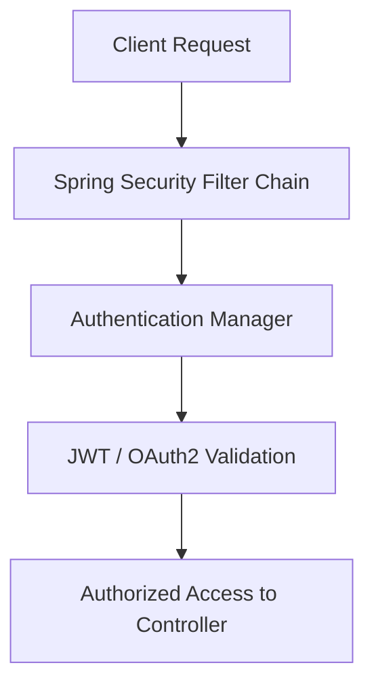

```mermaid
flowchart TD
    A["Client Request"] --> B["Spring Security Filter Chain"]
    B --> C["Authentication Manager"]
    C --> D["JWT / OAuth2 Validation"]
    D --> E["Authorized Access to Controller"]
```