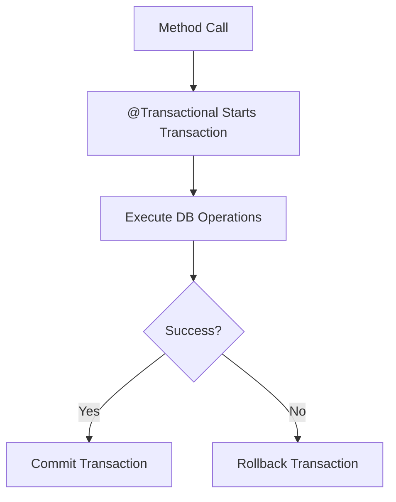

```mermaid
flowchart TD
    A["Method Call"] --> B["@Transactional Starts Transaction"]
    B --> C["Execute DB Operations"]
    C --> D{"Success?"}
    D -->|Yes| E["Commit Transaction"]
    D -->|No| F["Rollback Transaction"]
```