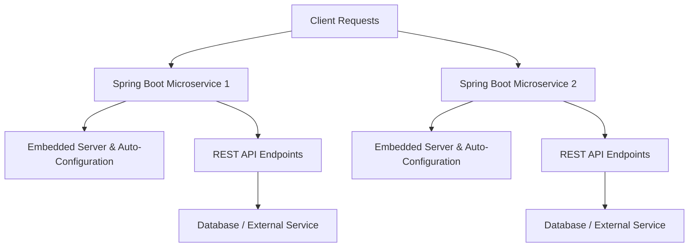

```mermaid
flowchart TD
    A["Client Requests"] --> B["Spring Boot Microservice 1"]
    A --> C["Spring Boot Microservice 2"]
    B --> D["Embedded Server & Auto-Configuration"]
    C --> E["Embedded Server & Auto-Configuration"]
    B --> F["REST API Endpoints"]
    C --> G["REST API Endpoints"]
    F --> H["Database / External Service"]
    G --> I["Database / External Service"]
```