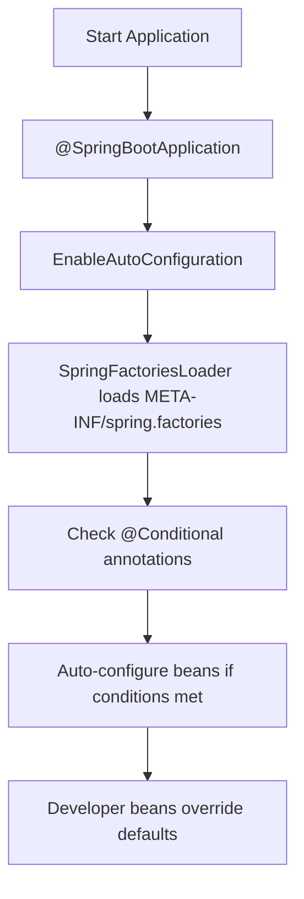

```mermaid
graph TD
    A["Start Application"] --> B["@SpringBootApplication"]
    B --> C["EnableAutoConfiguration"]
    C --> D["SpringFactoriesLoader loads META-INF/spring.factories"]
    D --> E["Check @Conditional annotations"]
    E --> F["Auto-configure beans if conditions met"]
    F --> G["Developer beans override defaults"]
```