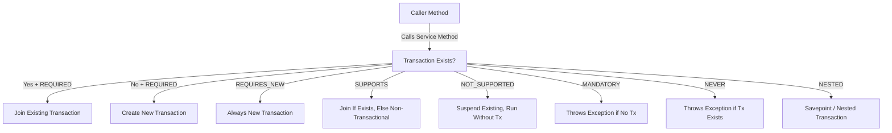

```mermaid
graph TD
    A[Caller Method] -->|Calls Service Method| B[Transaction Exists?]
    B -->|Yes + REQUIRED| C[Join Existing Transaction]
    B -->|No + REQUIRED| D[Create New Transaction]
    B -->|REQUIRES_NEW| E[Always New Transaction]
    B -->|SUPPORTS| F[Join If Exists, Else Non-Transactional]
    B -->|NOT_SUPPORTED| G[Suspend Existing, Run Without Tx]
    B -->|MANDATORY| H[Throws Exception if No Tx]
    B -->|NEVER| I[Throws Exception if Tx Exists]
    B -->|NESTED| J[Savepoint / Nested Transaction]
```