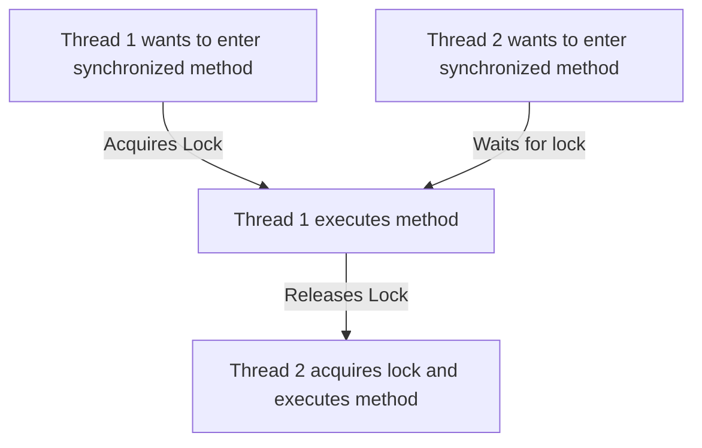

```mermaid
flowchart TD
    A[Thread 1 wants to enter synchronized method] -->|Acquires Lock| B[Thread 1 executes method]
    C[Thread 2 wants to enter synchronized method] -->|Waits for lock| B
    B -->|Releases Lock| D[Thread 2 acquires lock and executes method]
```